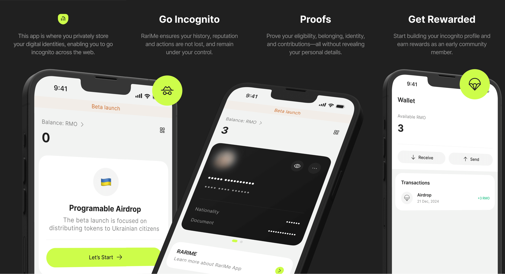

# RariMe Android App

RariMe is a self-custody identity wallet that allows users to verify their eligibility for Web3 services without exposing their personal data.

## Download

Requires Android 8.1 or higher.

## Features

- Programmable Airdrop for Ukrainian citizens
- NFC Passport scanner
- Rarimo wallet integration
- Secure keys & passport storage
- Face ID and passcode lock
- Passport card customization
- Light and dark mode
- Supported languages:
  - 🇺🇸 English
  - 🇺🇦 Ukrainian

## Resources

- [Website](https://rarime.com)
- [Documentation](https://docs.rarime.com)

## License

RariMe is available under the MIT license. See the [LICENSE](/LICENSE) file for more info.
